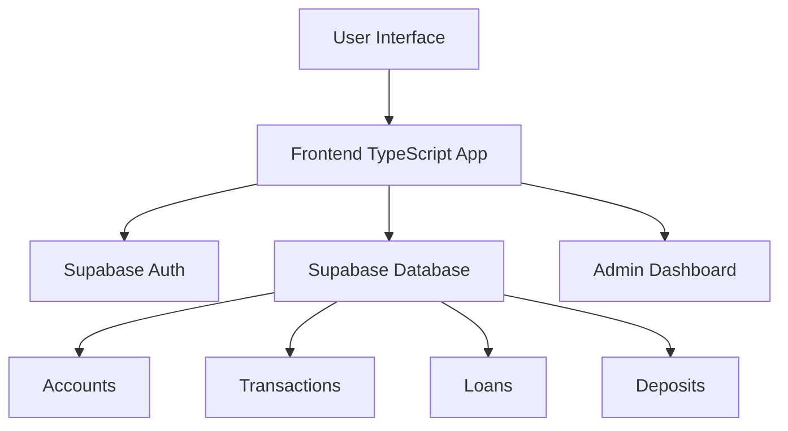

<div align="center">


# 🏦 RCK BANK Platform

<h3 align="center">
  
</h3>

<p align="center">
  
  
  
  
</p>

<p align="center">
  
  
</p>

</div>

---

# 🌟 Overview

**RCK BANK** is a modern digital banking platform inspired by fintech ecosystems like **Kaspi Bank**.

The platform includes:

- secure user authentication
- bank account management
- transfers
- loan applications
- deposit accounts
- admin analytics dashboard

The system is built using **TypeScript + Vite + Supabase** providing a full-stack banking simulation with real database integration.

---

# 🎯 Features

## 👤 User Features

✅ **Authentication**
- Email/password registration  
- Secure login  
- Session management  

✅ **Bank Accounts**
- Multiple account types  
- Balance tracking  
- Account status monitoring  

✅ **Money Transfers**
- Transfer between accounts  
- Transaction descriptions  
- Real-time balance updates  

✅ **Loans**
- Apply for loans  
- Select loan term (6–60 months)  
- Track loan status  
- Interest rate system (12% APY)  

✅ **Deposits**
- Create fixed deposits  
- Terms: 30 / 90 / 180 / 365 days  
- Interest rates: 8–10%  

✅ **Transaction History**
- Full transaction list  
- Filtering by account  
- Status tracking  

---

## 🛠 Admin Features

✅ **Analytics Dashboard**
- Total users
- Total system balance
- Active loans
- Total deposits
- Transaction statistics

✅ **User Management**
- View all users
- Account details
- User status

✅ **Account Administration**
- Monitor accounts
- Freeze / activate / close accounts

✅ **Loan Management**
- Approve or reject loans
- Track loan applications
- Auto-disburse funds

---

# 🏗️ System Architecture



---

# 🧰 Tech Stack

### Frontend
- TypeScript
- Vite
- HTML5 / CSS3
- Flexbox / Grid

### Backend
- Supabase
- PostgreSQL
- REST API

### Security
- Supabase Authentication
- Row Level Security (RLS)
- Environment variables

---

# 📁 Project Structure

```
RCK-bank-platform/

├── src/
│   ├── components/
│   │   ├── auth.ts
│   │   ├── UserDashboard.ts
│   │   └── Admindashboard.ts
│   │
│   ├── lib/
│   │   ├── supabase.ts
│   │   ├── auth.ts
│   │   ├── banking.ts
│   │   └── admin.ts
│   │
│   ├── main.ts
│   ├── style.css
│   └── vite-env.d.ts
│
├── supabase/
│   └── migrations/
│       └── bank_schema.sql
│
├── dist/
├── index.html
├── package.json
├── vite.config.ts
└── tsconfig.json
```

---

# 🚀 Installation

```bash
git clone https://github.com/yourusername/RCK-bank-platform.git

cd RCK-bank-platform

npm install
```

---

# ⚙️ Setup Supabase

1️⃣ Create project at:

```
https://supabase.com
```

2️⃣ Add environment variables

```
VITE_SUPABASE_URL=your_url
VITE_SUPABASE_ANON_KEY=your_key
```

3️⃣ Run SQL schema

```
supabase/migrations/bank_schema.sql
```

---

# ▶ Run Development Server

```bash
npm run dev
```

App will run on:

```
http://localhost:5173
```

---

# 📊 Database Schema

| Table | Description |
|------|-------------|
| profiles | user accounts |
| bank_accounts | user bank accounts |
| transactions | transfer history |
| loans | loan applications |
| deposits | deposit accounts |

---

# 💳 Key Banking Operations

## Money Transfer

- choose sender account
- enter receiver account
- amount
- description
- automatic balance update

---

## Loan Application

- loan amount ≥ 1000 KZT
- choose term (6–60 months)
- 12% interest rate
- admin approval workflow

---

## Deposit Creation

- minimum deposit: 10,000 KZT
- terms: 30–365 days
- interest: 8–10%

---

# 🔐 Security

✅ Supabase Auth  
✅ Row Level Security  
✅ Secure environment variables  
✅ HTTPS communication  

---

# 🎨 UI / UX

- Responsive layout
- Professional banking design
- Dashboard analytics
- Modal forms
- Status badges
- Currency formatting

---

# 🧪 Test Accounts

### Admin

```
admin@example.com
```

Set `is_admin = true` in Supabase profiles table.

---

# 🪙 Currency

All transactions use:

**KZT — Kazakhstani Tenge**

---

# 🚀 Future Improvements

- Mobile banking app
- Multi-currency support
- Investment services
- Credit cards
- Notification system
- Two-factor authentication
- Advanced analytics

---

<div align="center">

### 🏦 RCK BANK  
Modern Digital Banking Platform

Built with Fintech • TypeScript • Supabase

</div>
